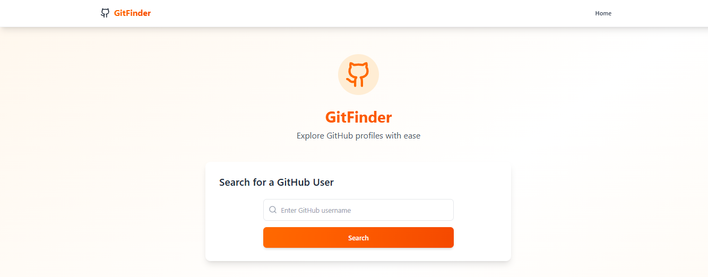
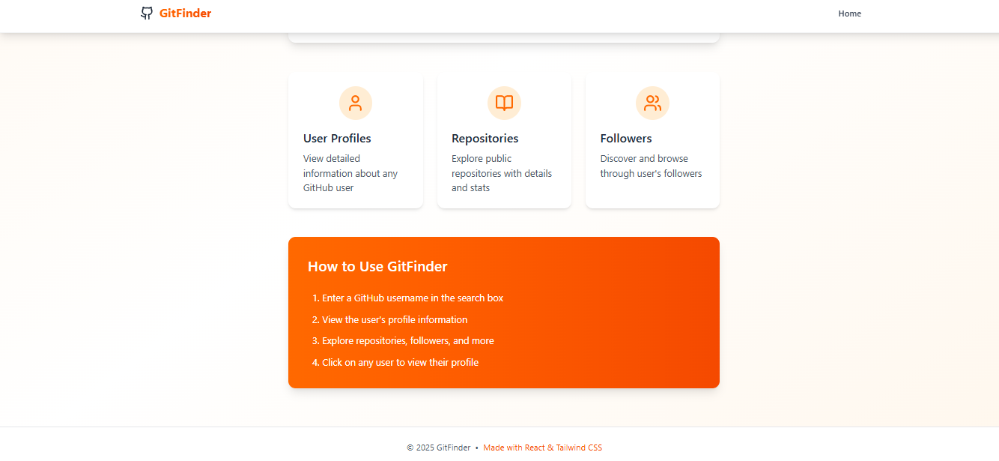
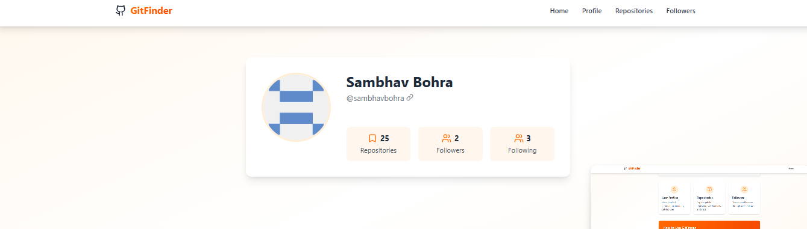
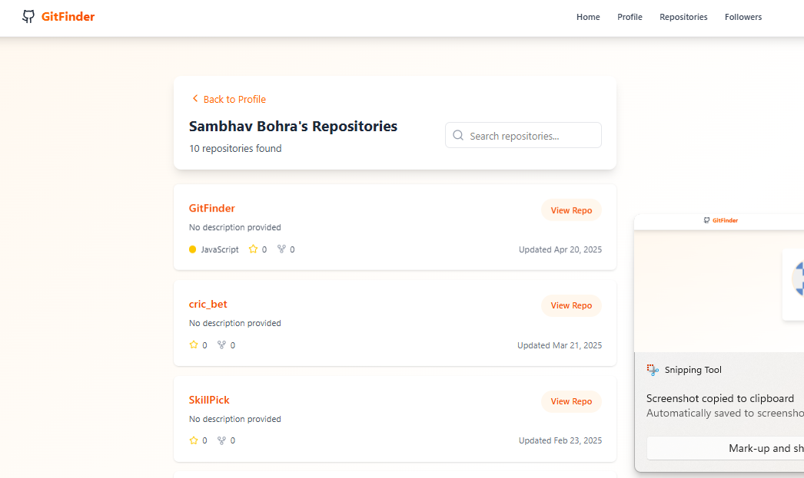
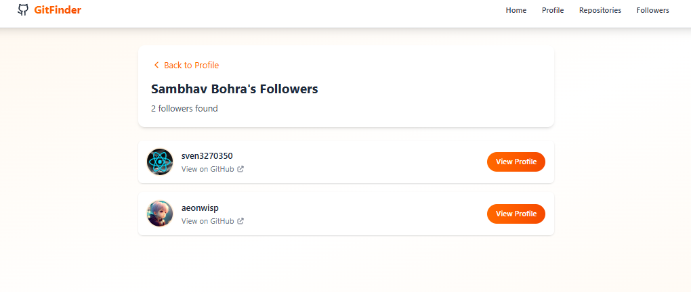

# GitFinder - GitHub User Explorer


## Description

GitFinder is a modern web application built with React.js and Tailwind CSS that enables users to search and explore GitHub profiles with ease. The app provides detailed user information, repositories, and follower details through the GitHub API, all wrapped in a sleek orange and white gradient theme with smooth animations.

## Features

- **GitHub User Search**
  - Quick username-based search
  - Real-time validation
  - Error handling

- **Detailed Profile Views**
  - User bio and stats
  - Repository count
  - Followers/Following metrics
  - Location and company info

- **Repository Explorer**
  - List of public repositories
  - Repository stats
  - Language detection
  - Sort and filter options

- **Follower Management**
  - Follower list view
  - Quick profile navigation
  - Interactive UI elements

## 🛠️ Tech Stack

### Frontend
- **React.js** - UI Components
- **React Router** - Navigation
- **Tailwind CSS** - Styling
- **Axios** - API requests
- **Lucide React** - Icons

### API
- GitHub REST API v3

## 📸 Screenshots

### Home Page


*Search interface with featured sections*

### Profile View

*Detailed user profile with stats*

### Repositories

*Repository listing with filters*

### Repositories

*Followers listing with filters*

## Quick Start

Follow these steps to set up the project and get started:

### 1. Install Required Dependencies
Make sure you have Node.js (v14 or higher) and npm installed on your system.

### 2. Clone the Repository
```bash
git clone https://github.com/yourusername/gitfinder.git
cd gitfinder
```

### 3. Install Project Dependencies
Run the following command to install all required dependencies, including React, React Router, Axios, Tailwind CSS, and Lucide React for icons:
```bash
npm install
```

### 4. Install Additional Dependencies
If you need to manually install specific dependencies, use the following commands:
- **Axios** for API requests:
    ```bash
    npm install axios
    ```
- **React Router** for navigation:
    ```bash
    npm install react-router-dom
    ```
- **Tailwind CSS** for styling:
    ```bash
    npm install tailwindcss
    ```
- **Lucide React** for icons:
    ```bash
    npm install lucide-react
    ```

### 5. Start the Development Server
Run the following command to start the development server:
```bash
npm run dev
```

The app will be available at `http://localhost:5173`.

### Prerequisites
- Node.js (v14 or higher)
- npm 
- Git


## 📦 Dependencies

```json
{
  "dependencies": {
    "react": "^18.2.0",
    "react-dom": "^18.2.0",
    "react-router-dom": "^6.x",
    "axios": "^1.x",
    "lucide-react": "^0.x",
    "tailwindcss": "^3.x"
  }
}
```

## 🎨 Color Scheme

```css
:root {
  --primary: #f97316;  /* Orange-500 */
  --secondary: #fff7ed;  /* Orange-50 */
  --text-primary: #1f2937;  /* Gray-800 */
  --text-secondary: #4b5563;  /* Gray-600 */
}
```

## Project Structure 🔧

```
gitfinder/
├── src/
│   ├── components/
│   ├── context/
│   ├── pages/
├── public/
└── package.json
```


## License

This project is licensed under the MIT License - see the [LICENSE](LICENSE) file for details.

## 👤 Author

Your Name
- GitHub: [@sambhavbohra](https://github.com/sambhavbohra)


---

<p align="center">Made with React and Tailwind CSS</p>